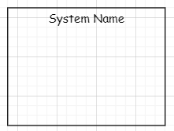
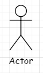
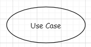
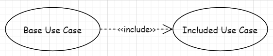
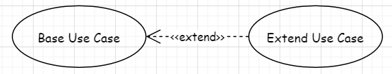
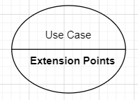
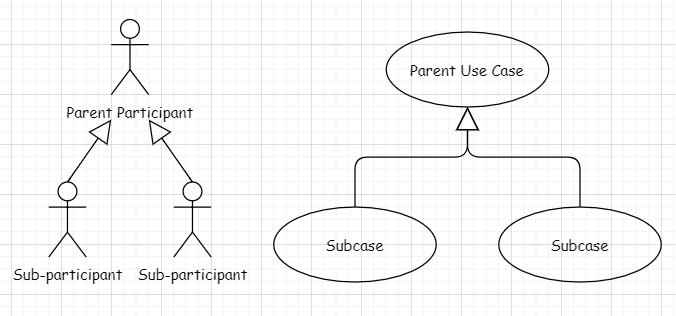

# 用例图
（use case diagram）是用户与系统交互的最简表示形式，展现了用户和与他相关的用例之间的关系。通过用例图，人们可以获知系统不同种类的用户和用例。用例图也经常和其他图表配合使用。

## 本次作業使用的模型元素

### 系統
使用一个矩形框表示一个系统，并将系统的名称放在顶部。在矩形内的所有东西都属于这个系统，而在矩形外的任何东西都能够使用这个系统。

### 參與者
用一个小人图形表示参与者。参与者放置在矩形框外部。参与者是使用系统的人或物，它可能是个人、一个组织、其他系统或者外部设备。参与者有三个重点因素

1. 参与者是系统的外部对象，需要放置在系统之外；
2. 参与者需要被视为类型或类别，它们不是特定的个人或者特定的组织。例如顾 客指代的是所有顾客，而并非某个人。
3. 参与者分为主要参与者和次要参与者。主要参与者是主动发起行为放置在系统左边，而次要参与者往往更为被动放置在系统右边。

### 用例
使用一个椭圆形来表示一个用例，在椭圆形内写上用例完成的动作。用例放置在矩形框内部。用例代表完成的系统中某种任务的一个动作，所以用例属于系统内部。用例的描述应着重于系统从外界来看有什么样的行为，而不管该行为在系统内部是如何具体实现的。

### 關聯
使用一根实线连接参与者和用例，表示参与者和用例在进行一种基本的交流或互动。注意：关联关系只用在执行者和用例之间，用例和用例之间不会存在关联关系

### 包含
使用一根带有箭头的虚线，由基本用例指向包含用例。包含关系表示基本用例和包含用例之间的依赖关系，每次执行基本用例的时候，也会执行包含用例。又或者说基本用例依赖包含用例。注意：每次调用基本用例时都必须同时执行包含用例。

### 扩展
使用一根带有箭头的虚线，由扩展用例指向基本用例。扩展关系由基本用例和扩展用例组成。当执行基本用例时，扩展用例不是一定要执行。它们只有在满足某些条件时才会执行。又或者说你可以使用扩展用例去扩展基本用例的行为。

### 带扩展点的用例
（用一根实线把用例分成两部分，上半部分写用例的名称，下半部分写用例的扩展点。扩展点只是扩展关系的详细版本。

### 泛化
使用一个带实线的三角形空心箭头来表示泛化关系，三角形箭头由子指向父。子参与者继承父参与者的所有关系、子用例继承父用例的所有结构、行为和关系。

#### 參考文獻
https://blog.csdn.net/thehellovie/article/details/129429312
